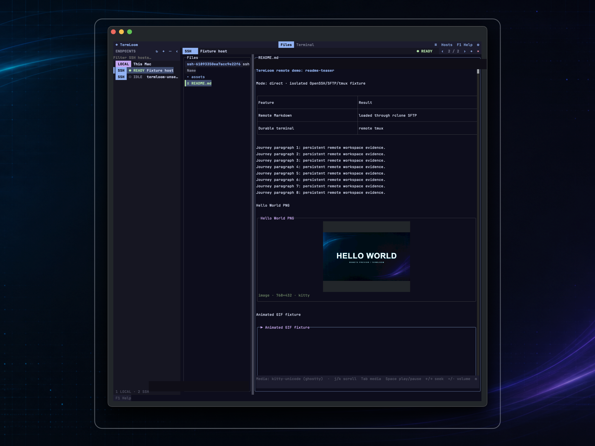
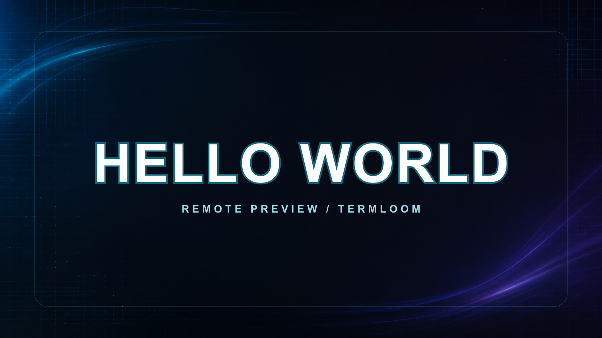
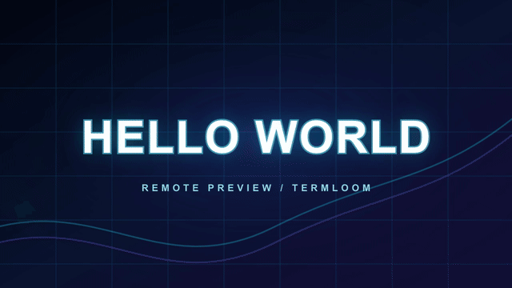

# TermLoom

> 🧵 终端原生工作区：本机文件、远端 SFTP、SSH 会话与丰富媒体，集中在一个 TUI 里。

[English](README.md) · [架构](docs/architecture.md) · [配置](docs/configuration.md)

[](https://github.com/Royalvice/termloom/actions/workflows/ci.yml)
[](https://github.com/Royalvice/termloom/releases)
[](LICENSE)
[](docs/releasing.md)
[](docs/releasing.md)

TermLoom 以支持鼠标的文件浏览器作为默认入口，按需打开终端，并且可以在不启动其他 App
的情况下渲染 Markdown、图片、GIF、视频和 LaTeX 公式。普通 Markdown 由 OpenTUI 以字符单元格
排版；公式由原生 Rust `termloom-math` sidecar（`term-maths` + `pulldown-latex`）解析并组合为二维
字符单元格。不支持或解析失败时只显示明确错误，不把源码拼成文字，也不转成栅格图片。PNG、GIF
和 MP4 在文档流中预留行区间后使用原生 Kitty/iTerm2 media surface。

它是 TUI，不是 terminal emulator、Ghostty 插件或 macOS GUI App。OpenTUI 负责界面；system
OpenSSH、远端 tmux、rclone SFTP、FFmpeg、mpv、resvg 和成熟 parser 负责协议与媒体；保留的
`termloom-render` 实验 helper 不在正常 Markdown 路径中。

## 立即体验



公开 demo 使用一次性合成 SSH/SFTP fixture，不包含个人主机或路径。

### Demo 媒体





[▶️ 播放激光字体 Hello World MP4](docs/assets/demo/hello-world-laser.mp4)

### 最小 Demo Workspace

在 Ghostty 中运行 `bun run demo:workspace`。TermLoom 会准备隔离 SSH fixture 并保持工作区
打开；你可以自己点击 Host、确认 SSH、进入 demo 目录，再点击 `README.md`、
`hello-world.png`、`hello-world.gif` 和 `hello-world-laser.mp4`。每个文件都会显示在右侧预览区。

同一个 workspace 保存在 [`docs/assets/demo/README.md`](docs/assets/demo/README.md)。

## 核心能力（v0.3.0）

- 📁 永久将 **Local** 放在侧栏顶部；没有有效 workspace 时默认选中 Local 并打开
  `$HOME`，不需要 SSH、rclone 或 tmux。其下自动显示 `~/.ssh/config` 与递归
  `Include` 中可枚举的 literal aliases。
- 🖥️ 单击远端 Host 只打开 Files/SFTP。选择 Host 本身不会执行 `tmux list-sessions`，
  也不会擅自创建远端 shell。
- 🧭 在远端 Host 上按 `F2` 或点击 **Terminal** 后，明确选择 **Direct SSH** 或
  **Tmux**；只有选择 Tmux 才开始发现 session。
- 每个 Local/SSH target 各自保活 Files 与 Terminal surface。顶部不再平铺一排等权 Host
  tab，而是只显示一个当前 workspace context，并提供前后切换；切换 context、surface
  或分屏都不会销毁隐藏状态。
- 端点状态不只依赖颜色：每行同时显示类型 badge、状态形状、状态文字（`LOCAL`、
  `IDLE`、`READY`、`AUTH`、`RETRY` 或 `ERROR`）和高对比选中背景。
- Termius 风格的自适应文件区：
  - 84 列及以上：父目录、当前目录、预览三栏。
  - 48–83 列：当前目录、预览双栏。
  - 小于 48 列：只显示当前目录；打开预览后按 `Escape` 返回。
- 目录、文本、图片、视频、压缩包、源码/配置、可执行文件和未知文件同时使用不同的
  单格符号与颜色；目录优先、自然排序，选中行使用高对比背景而不是只靠颜色区分。
- 单击文件立即选择，并在短暂防抖后预览；双击目录进入。选择目录时，预览区显示其
  子项摘要。
- Files 路径栏提供紧凑、可点击的 `← 上一级`；它复用同一套 Local/SFTP 路径规则，在
  Local 或 SFTP 根目录自动禁用。
- 🔒 Files 为严格只读：Local 与 SFTP 只支持浏览、搜索、预览、刷新与导航；不暴露源文件的
  新建、重命名、复制、移动、覆盖、上传或删除；`Copy Absolute Path` 只把路径文本写入剪贴板。
- 可明确将远端文件或目录下载到本机（默认 `~/Downloads/<名称>`）。确认框中的目标可编辑，
  同名自动编号且永不覆盖；直接选择符号链接会拒绝，目录内部链接会跳过并在状态中提示，
  不会打开任何 GUI 应用。
- 🖼️ 在 OpenTUI pane 内只读渲染 GFM Markdown、表格、安全 HTML、字符级 inline/block 数学、
  PNG、JPEG、WebP、SVG、动画 GIF 和 MP4。正文与已支持的数学子集都使用 OpenTUI 字符级
  styled spans/cell；图片、GIF 和 MP4 在文档流中预留行区间后使用独立 Kitty/iTerm2 media
  surface。旧 `termloom-render` mlux/Typst PNG tile 路径只保留为历史实验，Markdown 预览不会
  调用它；本机 Markdown 直接解析相对媒体，远端 Markdown 通过 SFTP 将获准的静态资源加载。
- 🎞️ GIF/MP4 支持播放/暂停、seek、音量、静音、进度和 pane-native fullscreen。FFmpeg
  生成画面；视频包含音轨时，mpv 以无窗口方式提供音频与播放时钟。
- host-key、私钥口令、密码和 2FA 都通过内嵌 system SSH PTY 完成。Files、Direct SSH
  与 Tmux 共享每 Host 的 ControlMaster，不建立第二套凭证存储。
- 使用 workspace schema v3 恢复上次 target、路径、选择、预览、Files/Terminal
  surface、tabs、splits、focus 与已 attach 的 terminal 意图。Direct SSH 非正常中断后按
  reconnect 配置恢复；正常 `exit` 后保持结束状态，直到按 Enter 或点击重连。

## 复用的现有轮子

| 职责 | 实现 |
| --- | --- |
| TUI 布局、输入、鼠标与渲染生命周期 | OpenTUI Core、OpenTUI keymap |
| PTY 与 VT/ANSI 状态 | `bun-pty`、`@xterm/headless` |
| SSH 配置与认证 | system OpenSSH、每 Host ControlMaster |
| SSH Config 自动发现 | `ssh-config`、Bun glob，最终以 `ssh -G` 为真相 |
| 耐久远端会话 | 远端系统 tmux，仅在用户选择后加载 |
| 本机文件 | Node/Bun `fs/promises` + `LocalFileProvider` |
| 远端文件 | rclone `:sftp:` + `--sftp-ssh` 复用 ControlMaster |
| 字符级 Markdown 正文（已接受目标） | OpenTUI styled spans/cell framebuffer；unified、remark、rehype |
| 媒体 surface 与有限栅格 helper | Kitty/iTerm2 placement；FFmpeg/resvg；保留的 Rust `termloom-render` mlux/Typst 实验 |
| Markdown 公式边界 | 原生 `term-maths` LaTeX cell layout + 严格 `pulldown-latex` 校验；不支持语法明确报错 |
| 图片/GIF/视频帧 | FFmpeg、ffprobe |
| 视频音频与时钟 | mpv JSON IPC，禁用视频与窗口输出 |
| 终端媒体 | Kitty Unicode placement、iTerm2 inline image、truecolor half-block cell |

完整 ownership 与生命周期见[架构文档](docs/architecture.md)。

## 环境要求

v0.3.0 二进制发布目标是 macOS arm64；源码构建与 CI 同时覆盖 Linux x64 和 macOS
x64。当前不支持 Windows。

本机文件浏览和本机文本/Markdown/媒体预览不依赖 SSH、tmux 或 rclone。以下外部程序
分别启用对应能力：

| 程序 | 用途 |
| --- | --- |
| `ssh` | 远端认证、Direct SSH、Tmux 与 SFTP transport |
| 支持 `--sftp-ssh` 的 `rclone` | 远端只读浏览、预览与安全下载 |
| 远端 Host 上的 `tmux` | 用户显式选择的持久 session 路径 |
| `ffmpeg`、`ffprobe` | 图片/GIF/视频解码与元数据 |
| `mpv` | 含音轨视频的音频与播放时钟 |
| `resvg` | SVG 媒体栅格化与保留的历史 helper 支持 |

macOS 可使用：

```bash
brew install tmux rclone ffmpeg mpv resvg
```

Release archive 不捆绑或自动安装这些工具。启动前可检查当前环境：

```bash
termloom doctor
termloom doctor --json
```

`doctor --no-terminal-probe` 适合 CI 和非交互环境，但无法确认真实终端中的媒体协议。

## 安装

### macOS arm64 Release

从同一个 v0.3.0 GitHub Release 下载 archive 与 checksum：

```bash
shasum -a 256 -c termloom-v0.3.0-darwin-arm64.tar.gz.sha256
tar -xzf termloom-v0.3.0-darwin-arm64.tar.gz
install -d "$HOME/.local/bin"
install -m 0755 termloom-v0.3.0-darwin-arm64/termloom "$HOME/.local/bin/termloom"
```

二进制经过 ad-hoc signing，**没有 Apple notarization**。如果 macOS 隔离下载文件，
先核对 SHA-256 与 GitHub Release 来源；确认信任该精确文件后：

```bash
xattr -d com.apple.quarantine "$HOME/.local/bin/termloom"
```

不要全局关闭 Gatekeeper。

### 从源码构建

开发和编译固定使用 Bun 1.3.14：

```bash
git clone https://github.com/Royalvice/termloom.git
cd termloom
bun install --frozen-lockfile
bun run check
bun run start
```

构建并验证当前平台的 native executable：

```bash
bun run build
bun run verify:build
```

`private: true` 是有意设置。TermLoom 通过源码与 GitHub Release 二进制发布，不发布
npm package。

## 第一次使用

运行 `termloom`。没有有效已保存 workspace 时，TermLoom 默认选择 **Local** 并打开
`$HOME`，不会执行任何 SSH 或 tmux 命令。

访问远端 Host：

1. 先准备可用的 OpenSSH alias。TermLoom 枚举 literal `Host`，递归展开 `Include`；
   wildcard-only 目标可通过侧栏 `+` 添加 alias。
2. 单击 Host；如有 host-key、私钥口令、密码或 2FA，在内嵌认证区完成。此时只打开
   Files/SFTP。
3. 单击文件预览，双击目录进入；在文件行或目录空白处右键打开只读操作。选择
   `Copy Absolute Path` 可复制文件或目录路径；路径栏支持 `Command+C`/`Command+V` 文本复制
   与粘贴。对远端选择按 `Shift+D` 可下载到确认框展示且可编辑的本机目标；需要回退时点击
   路径栏的 `← 上一级`。
4. 需要终端时按 `F2`。选择 **Direct SSH** 打开普通 shell，或选择 **Tmux** 后再
   发现、新建、attach 持久 session。
5. 再按 `F2` 回到 Files；隐藏的 terminal backend 继续运行。

TermLoom 只刷新当前远端 Files，以及用户已经明确打开过的 Tmux picker。健康的共享
ControlMaster 会被静默复用，不会重复广播连接状态或触发 Files refresh 循环。

## 鼠标与键盘

常用路径均可点击：单击选择/聚焦，双击激活，右键打开受 viewport 边界约束的菜单，
滚轮滚动鼠标所在区域，侧栏与 split divider 可以拖拽。Context menu 会在
`Escape`、点击外部、再次右键、执行菜单项、切换 target/surface/tab、resize、
renderer 失焦或被其他 overlay 替换时关闭。

TermLoom 内嵌 Terminal 中输出的可信绝对 POSIX 路径或 `file:///` URI 会**始终带下划线**，
不需要猜测哪里可以跳转。悬停时路径会加粗、鼠标变为指针，底部暂时显示
`在文件视图打开 · Ctrl+单击`。按住 `Ctrl` 再左键单击，会在**同一个 Local/SSH target** 的
Files surface 打开它：文件进入父目录并自动选中预览，目录则直接进入。末尾的 `:line` 或
`:line:column` 会被识别；例如 shell 输出 `-bash: /path: Is a directory` 时，会正确把
`/path` 当作目录，同时保留对少见的、确实以 `:` 结尾的文件名的安全验证。相对路径不会猜测；
普通鼠标事件仍然转发给 shell、tmux、Vim 等终端程序。

Files 路径栏使用终端原生剪贴板事件：`Command+C` 复制当前地址文本，`Command+V` 插入粘贴
文本。Terminal pane 中按住鼠标左键拖选字符，会显示选区高亮；按 `Command+C` 复制。若子程序
开启了鼠标跟踪，按住 `Shift` 再拖选可把选择保留给 TermLoom；`Command+V` 仍通过 PTY 的
bracketed paste 路径粘贴。

底部唯一常驻提示是 `F1 帮助`；其他命令都可以在 Help & Commands 中搜索。

| 按键 | 操作 |
| --- | --- |
| `F1` | 打开可搜索的 Help & Commands |
| `F2` | 在当前 target 的 Files 与 Terminal 间切换 |
| `Ctrl+Q` | 刷新 workspace 状态并退出 |
| `Ctrl+G` | 默认高级命令 leader |
| `Ctrl+G Ctrl+G` | 向 terminal 发送原始 Ctrl+G/BEL |
| `Ctrl+G F2` | 向 terminal 发送原始 F2 序列 |
| `Ctrl+Space` | 不被 TermLoom 截获，直接进入当前 PTY |

文件浏览聚焦时可使用：`j/k` 或方向键、`Enter`、`Escape`/Backspace、`r`
刷新、`/` 搜索、`Shift+D` 下载当前远端文件或目录、`x` 只取消当前 Host/pane 所属的
最近下载、`[`/`]` 翻页。文件右键菜单提供 `Copy Absolute Path`；Local Files 不显示下载，
因为数据已经在本机。

完整 leader map 和配置说明见[配置与快捷键](docs/configuration.md)。

## 终端媒体行为

TermLoom 根据 OpenTUI 的实时 capability 选择 adapter。Direct Kitty 与 iTerm2-family
协议可以保留更多图像细节；当 direct image placement 不可用，或位于外层 tmux 中时，
使用仍然完全驻留在终端内的 truecolor-cell 渲染。

对于 direct、被明确识别为 Ghostty 或 Kitty 的会话，`auto` 选择带 Unicode placement 的
原生 Kitty graphics：图片/视频帧作为 raster 传输，不会下采样到字符格。外层 tmux 为了
不假设 graphics passthrough，会诚实使用较低空间分辨率的 `truecolor-cells` fallback。

| 环境 | 预期 adapter | 协议 |
| --- | --- | --- |
| Ghostty direct | `kitty` | Kitty graphics + Unicode placement |
| Kitty direct | `kitty` | Kitty graphics + Unicode placement |
| WezTerm direct | `iterm2` | iTerm2 inline image |
| iTerm2 direct | `iterm2` | iTerm2 inline image |
| 外层 tmux 内 | `truecolor-cells` | Portable truecolor half-block cells |

精确的终端版本和带日期验收证据见[终端兼容性](docs/terminal-compatibility.md)。

## 验证状态

当前源码门禁覆盖：

- 当前 lockfile 下 220 个自动化测试、939 个断言、3 个终端尺寸 snapshot，没有用 skip
  或删除断言掩盖回归。
- 只读 Local/SFTP provider、无源文件 mutation API/UI/shortcut、绝对路径剪贴板复制、地址栏
  剪贴板事件、安全远端文件与目录下载、归属隔离取消、自适应彩色文件区、鼠标选择、预览
  防抖/取消和 context-menu 关闭路径。
- SSH Config/Include 递归发现、内嵌认证、共享 ControlMaster、加密私钥、密码/2FA
  fixture、rclone SFTP、Direct SSH 和仅在显式请求后的 tmux 操作。
- config v1→v2、workspace v1/v2→v3 迁移，包括 Local/`$HOME` 默认值，以及旧远端
  terminal、splits、focus 和 tmux attach 的保留。
- 字符级 Markdown 正文与原生 LaTeX cell layout；语料覆盖上下标、希腊字母、运算符、根号、分式、
  积分、矩阵、cases 和数学字体。解析/排版失败会在文档中显示结构化错误。另覆盖预留行的
  PNG/JPEG/WebP/SVG/GIF/MP4 media surface、Markdown 资源解析、FFmpeg/ffprobe、mpv JSON IPC、
  有界预览、下载取消、Direct SSH 恢复和子进程 teardown。已拒绝的整页 PNG tile 路线仅作为
  partial 实验记录，不代表验收完成。
- native compile verifier，以及 direct 和外层 tmux 中的真实 PTY journey。

GitHub-hosted Ubuntu x64 与 macOS x64 会重复 frozen install、format、lint、
TypeScript、licenses、完整测试、native compile 和 compiled-binary verifier。
Release 验收还要求匿名 clone/download、checksum、BUILDINFO、codesign、真实 PTY、
Local/SFTP/Direct SSH/显式 Tmux、媒体与精确进程清理全部一致。

## 持久化与隐私

| 数据 | 默认路径 |
| --- | --- |
| 配置 | `~/.config/termloom/config.toml` |
| Workspace 状态 | `~/.local/state/termloom/workspaces.json` |
| Resource 与 SSH control cache | `~/.cache/termloom/` |
| 诊断日志目录 | `~/.local/state/termloom/logs/` |

配置保持 schema v2；workspace 状态使用显式 Local/SSH target 的 schema v3。有效旧文档
会先校验、以仅用户可读权限备份、迁移、再次校验，再原子写入；无效文件会明确报错并
原样保留。

密码、私钥、passphrase、OTP 和 token 从来不是配置或 workspace 字段。Markdown 引用
的 HTTP(S) 资源在对 origin 发出第一次请求前即被阻止；按 `o` 本次允许，或按 `P`
持久允许一个不含 scheme/port/path/credential/wildcard 的裸域名。

## 文档

- [架构](docs/architecture.md)
- [配置与快捷键](docs/configuration.md)
- [终端兼容性](docs/terminal-compatibility.md)
- [故障排查](docs/troubleshooting.md)
- [发布流程](docs/releasing.md)
- [贡献指南](CONTRIBUTING.md)
- [安全策略](SECURITY.md)
- [第三方说明](THIRD_PARTY_NOTICES.md)

## 范围边界

v0.3.0 不提供文本编辑器、terminal emulator、SSH/SFTP 协议实现、tmux 替代品、媒体
codec、任何 Files 修改能力、自动系统包安装、外部 GUI 兜底、npm package、Windows build、
Developer ID signing 或 Apple notarization。

## License

TermLoom 使用 [MIT License](LICENSE)。编译分发所需声明位于
[THIRD_PARTY_NOTICES.md](THIRD_PARTY_NOTICES.md) 与生成的
[THIRD_PARTY_LICENSES.txt](THIRD_PARTY_LICENSES.txt)。
